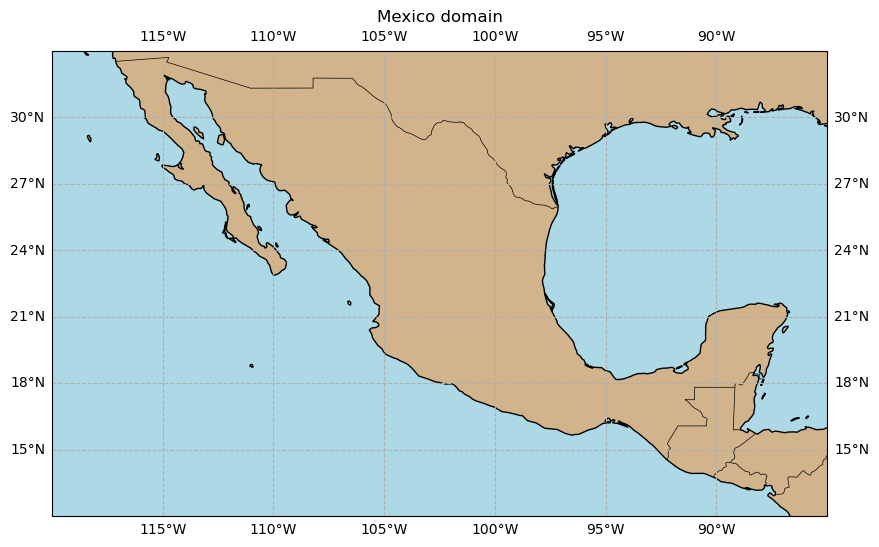
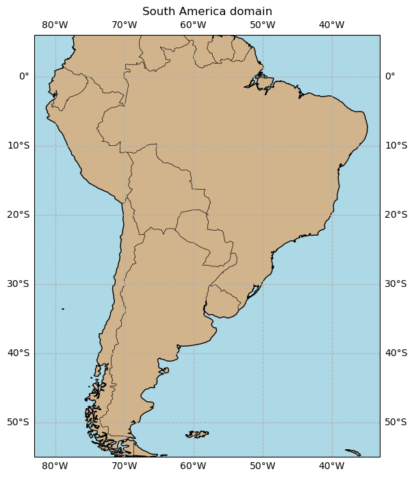

# Latin America Testbed

The Latin America Testbed is comprised of four intercomparisons:
1. Lightning nowcasting over South America
2. Precipitation nowcasting over South America
3. Lightning nowcasting over Mexico
4. Precipitation nowcasting over Mexico

Contents:

* [Committee](#committee)
* [Participants](#participants)
* [Lightning Nowcasting Intercomparison](#lightning-nowcasting-intercomparison)
    * [Problem](#problem)
    * [Domains](#domains)
    * [The Dataset](#the-dataset)
        * [Target Data](#target-data)
        * [Example Prediction Data](#example-prediction-data)
* [Precipitation Nowcasting Intercomparison](#precipitation-nowcasting-intercomparison)
    * [Problem](#precip-problem)

## Committee

- John Cintineo (NOAA)
- Alan Calheiros (INPE)
- Rachel Albrecht (USP)
- Paola Salio and Juan Ruiz (UBA)
- Shigenori Otsuka (RIKEN)
- Haiyu Dong and Zuliang Fang (Microsoft)
- Raúl Aquino Santos (Universidad de Colima)
- Fernando Pech May (ITSR)
- Pedro Cruz e Silva (NVIDIA)
- Simon Pfreundschuh (CSU)

## Participants

| Product Type | Product Provider | Source Data | Lead Time (h) | Time Res. | Spatial Res. (SA/Mex) |
| ------------ | ---------------- | ----------- | ------------- | --------- | --------------------- |
| Lightning    | NOAA/CIMSS       | GOES        |  2            |   10 min  |    10 km / 10 km      |
| Lightning    | PyFortraCC/Pers. | GOES        |  2            |   10 min  |     10 km / 10 km     |
| QPF          | Microsoft        | Radar / GOES|  2?           |   10 min  |          5 km?        |
| QPF          | Brazil/INPE      | Radar / GOES|  2?           |   10 min  |          5 km?        |
| QPF          | Japan/RIKEN      |  GOES       |  6            |   60 min  |       2 km / 10 km    |
| QPF          | Colo. State Univ.|  GOES?      |  2?           |   10 min  |          5 km?        |

## Lightning Nowcasting Intercomparison

### Problem

The problem we are trying to solve is predicting lightning in 120 minutes following a given time. We use GOES-East Geostationary Lightning Mapper (GLM) data as the truth data. Specificially, the maximum 10-minute flash-extent density over the ensuing 60 or 120 minutes.
Since we are trying to only predict the occurrence of any lightning (i.e. ≥ 1 flash), the flash-extent density fields can be binarized into lightning masks. Predictions are in units of "probability of **any** lightning" within a given time frame.

After reading this wiki, see [this notebook](https://colab.research.google.com/drive/1CTz2oMtHW_5m6YZAqJRwa0hp3nFTOm_3#scrollTo=aSNRqLueWA15) for some examples on working with the data.

### Domains

#### Mexico Domain

One domain for the lightning intercomparison will be centered over Mexico, as shown below.



#### South America Domain

Another domain for the lightning intercomparison will be over most of South America, as shown below.



### The Dataset

The dataset can be found on zenodo (https://zenodo.org/records/14261376). The initial version of this dataset is for 30 days for each domain:

- **South America: 5th - 9th of September 2023 through February 2024**
- **Mexico: 5th - 9th of April 2024 through September 2024**

#### Target Data

As stated above, the targets are 120-minute accumlations of GLM flash-extent density. It has 10-minute temporal resolution and 0.1-deg-lat by 0.1-deg-lon spatial resolution. The data are netCDF4 format.

Here is an example target/truth filename: `FED-accum-120min-10km_s20230905-000000_e20230905-020000.nc`

- `FED-accum-120min-10km` is the truth metric. In this case, "flash-extent density accumulation in 120 minutes at 10-km resolution".
- `s20230905-000000` is the start time of the accumulation in UTC. The format is `sYYYYmmdd-HHMMSS`.
- `e20230905-020000` is the end time of the accumulation in UTC. The format is `eYYYYmmdd-HHMMSS`.

```
netcdf FED-accum-120min-10km_s20230905-000000_e20230905-020000 {
dimensions:
	x = 501 ;
	y = 611 ;
variables:
	float FED-accum-120min-2km(y, x) ;
		FED-accum-120min-2km:units = "flashes" ;
		FED-accum-120min-2km:long_name = "Max flash-extent density in previous 120 min" ;

// global attributes:
		:NW_lat = 6 ;
		:NW_lon = -83 ;
		:SE_lat = -55 ;
		:SE_lon = -33 ;
		:dy = 0.1 ;
		:dx = 0.1 ;
		:subsatellite_longitude = -75. ;
		:orbital_slot = "GOES-East" ;
		:platform_ID = "G16" ;
		:scene_id = "South America" ;
		:time_coverage_end = "2023-09-05T02:00:00Z" ;
		:time_coverage_start = "2023-09-05T00:00:00Z" ;
		:aggregation = "120 min" ;
		:dataset_name = "GLM_gridded_data" ;
		:sector = "RadF" ;
}
```

#### Example Prediction Data

The example prediction data come from the [NOAA/CIMSS LightningCast](https://cimss.ssec.wisc.edu/severe_conv/pltg.html) model. Predictions from this satellite-based deep-learning model are remapped to the truth/target resolutions (10-minute, 0.1 x 0.1 degrees). The prediction data are also found on Zenodo.

Here is an example file for predictions: `predictions_LTG_NOAA_s20230905-000020_e20230905-020020.nc`.

- `predictions` just means these are prediction files.
- `LTG` indicates that these are predictions for lightning, as opposed to `QPF`.
- `NOAA` is the source model or institution, in this example.
- `s20230905-000020` is the start time of the accumulation in UTC. The format is `sYYYYmmdd-HHMMSS`.
- `e20230905-020020` is the end time of the accumulation in UTC. The format is `eYYYYmmdd-HHMMSS`.

```
netcdf predictions_LTG_NOAA_s20230905-000020_e20230905-020020 {
dimensions:
	nlat = 611 ;
	nlon = 501 ;
variables:
	float predictions(nlat, nlon) ;
		predictions:units = "Probability of lightning in next 2 hours" ;
		predictions:native_units = "Probability of lightning in next 1 hour" ;
		predictions:model_source = "NOAA/CIMSS LightningCast" ;

// global attributes:
		:project = "WMO AI Nowcasting Pilot Project (AINPP)" ;
		:NW_lat = 6LL ;
		:NW_lon = -83LL ;
		:SE_lat = -55LL ;
		:SE_lon = -33LL ;
		:dy = 0.1 ;
		:dx = 0.1 ;
		:time_coverage_start = "20230905-000020 UTC" ;
		:time_coverage_end = "20230905-020020 UTC" ;
		:time_created = "20241101-143908 UTC" ;
}
```

## Precipitation Nowcasting Intercomparison

### Problem {#precip-problem}

The problem we are trying to solve is predicting precipitation amount (quantitative precipitation forecast, QPF) in hourly increments over the a period of 6 hours from the forecast start time.

We have three domains for this intercomparison:

- Central America domain (see figure above)
- South America domain (see figure above)
- Brazil RADAR, Jaraguari domain (see "RADAR" inset in South America image above)
  
### The Dataset

All data is remapped to a 0.1-deg x 0.1-deg grid. 

Here are the evaluation periods for each domain:

- Central America: January-December of 2024, every hour
- South America: January-December of 2024, every hour
- **Brazil, RADAR domain: ???**

#### Target Data

We use several sources for the target/truth data:

- Central America domain: [GSMaP](https://sharaku.eorc.jaxa.jp/GSMaP/) near-real time (NRT)
- South America domain: GSMaP NRT
- Brazil RADAR, Jaraguari domain: radar-derived QPF.

**Q: Where is the target data? Who will create the QPF from GSMaP mm/hr data?**
**Example target data template needed!**
